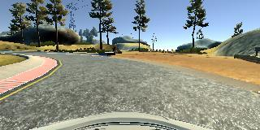

# **Behavioral Cloning**

**Behavioral Cloning Project**

The goals / steps of this project are the following:
* Use the simulator to collect data of good driving behavior
* Build, a convolution neural network in Keras that predicts steering angles from images
* Train and validate the model with a training and validation set
* Test that the model successfully drives around track one without leaving the road
* Summarize the results with a written report

## Rubric Points
###Here I will consider the [rubric points](https://review.udacity.com/#!/rubrics/432/view) individually and describe how I addressed each point in my implementation.

---
###Files Submitted & Code Quality

####1. Submission includes all required files and can be used to run the simulator in autonomous mode

My project includes the following files:
* model.py containing the script to create and train the model
* drive.py for driving the car in autonomous mode
* model.h5 containing a trained convolution neural network
* writeup_report.md summarizing the results
* video1 video summary of car driving on a track 1

####2. Submission includes functional code
Using the Udacity provided simulator and my drive.py file, the car can be driven autonomously around the track by executing

```sh
python drive.py model.h5
```

####3. Submission code is usable and readable
The model.py file contains the code for training and saving the convolution neural network. The file shows the pipeline I used for training and validating the model.

###Model Architecture and Training Strategy

####1. An appropriate model architecture has been employed

Preprocessing steps for the data involved normalization of the images and cropping. These steps were incorporated into the Keras Pipeline.

My model architecture is as follows -


| Layer           | Input      | Output     |
|-----------------|------------|------------|
| Convolution2d   | 65, 320, 3 | 61, 316, 6 |
| MaxPooling      | 61, 316, 6 | 30, 158, 6 |
| Dropout         |            |            |
| Convolution2d   | 30, 158, 6 | 26, 154, 6 |
| MaxPooling      | 30, 158, 6 | 13, 77, 6  |
| Flatten         | 13, 77, 6  | 6006       |
| Fully Connected | 6006       | 120        |
| Fully Connected | 120        | 84         |
| Fully Connected | 84         | 1          |

Dataset Size: 732,451

I experimented with the NVidia model architecture but found the above mentioned one to be sufficient to train my model.


####2. Attempts to reduce overfitting in the model

One of the suggested steps was to split the model into training test and validation sets which I have done in my model. I've shuffled the data to avoid overfitting.

```
model.fit(X_train, y_train, validation_split=0.2, shuffle=True, nb_epoch=20, verbose=1)
```

My architecture includes a Dropout of 0.7 in the 2nd convolution layer to prevent overfitting.

####3. Model parameter tuning

The model used an adam optimizer.

####4. Appropriate training data

Tuning the training data was the most important part of this assignment.

* Initial Approach:
My initial approach involved training with multiple laps of the car on the track. This approach failed to take into account all the turns. While trying to add additional training data for each of the turns the model was unable to take into account the new turns data.

* Final Approach:
My final approach involved training on a single lap of data and testing the model. I noted the points of failure for the data and retraining the data on the failed sections of the lap one section at a time. I used image data for the center, left and right images. For the left and right images I added a delta of 0.2 and -0.2 to the steering angle measurement. This was inkeeping with the intuition of the Nvidia architecture where all three cameras were used to determine the steering angle.

A big improvement to the model involved flipping the images and using the augmented image data which enabled balancing the mode on the road.


###Model Architecture and Training Strategy

####1. Solution Design Approach

After training with data from a single lap I experimented with different models to see which one performs the best.

Model 1:
My first model was a simple Fully Connected Dense Layer. As expected this performed badly (around 40% validation accuracy).

Model 2:
I planned on adding a convolutional layer to the dense model. A single convolution was able to offer drastic improvements. However the single convolution layer using 1 x 1 strides and a filter size of 2 took too long to train.

In the videos preceding the assignment a two layer model was mentioned that I finally ended up using as my final architecture for the project. The final model architecture is mentioned in the following section.

I experimented with the Nvidia model but found my final architecture easier to work with. At the end of the process, the vehicle is able to drive autonomously around the track without leaving the road.

####2. Final Model Architecture

The final model architecture (model.py lines 77-93) consisted of a convolution neural network with the following layers -

| Layer           | Input      | Output     |
|-----------------|------------|------------|
| Convolution2d   | 65, 320, 3 | 61, 316, 6 |
| MaxPooling      | 61, 316, 6 | 30, 158, 6 |
| Dropout         |            |            |
| Convolution2d   | 30, 158, 6 | 26, 154, 6 |
| MaxPooling      | 30, 158, 6 | 13, 77, 6  |
| Flatten         | 13, 77, 6  | 6006       |
| Fully Connected | 6006       | 120        |
| Fully Connected | 120        | 84         |
| Fully Connected | 84         | 1          |

####3. Creation of the Training Set & Training Process

To capture good driving behavior, I first recorded a single laps on track one using center lane driving. Here is an example image of center lane driving:



This image was flipped around to adjust the dataset


Initially I trained with only these two types of images. On further iterations I added pictures from the left and the right car cameras


The dataset was preprocessed using simple image processing equations which were incorporated into my Keras Pipeline. It was also cropped to prevent non-road data from interfering with the model's performance

This is the image on normalization -


This is the image on cropping -


My dataset size for my final model had 732,451.

Around 20% of the data was used for validation.

I used this training data for training the model. The validation set helped determine if the model was over or under fitting. I experimented with the number of epochs and while 10 epochs was sufficient to train the data my validation loss reduced from 10% to 7% after training for 30 epochs. I used an adam optimizer so that manually training the learning rate wasn't necessary.
